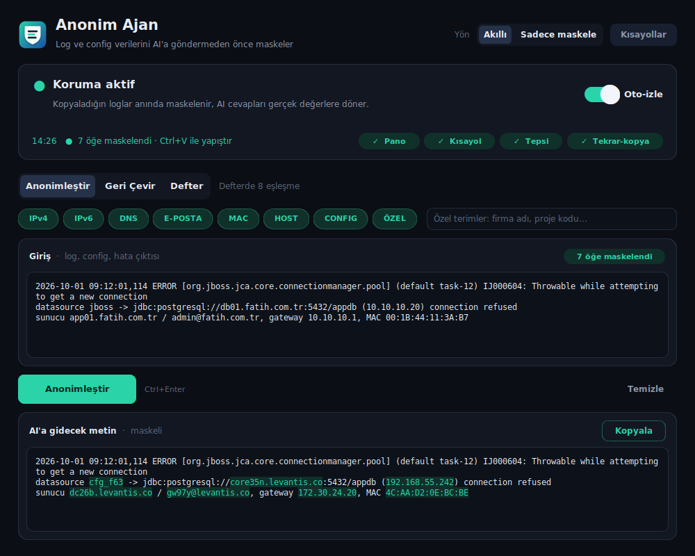

# Anonim Ajan

Log ve config çıktılarını ChatGPT, Claude gibi AI araçlarına göndermeden önce
**IP, DNS, hostname, e-posta, MAC ve config değerlerini** tutarlı sahtelerle
maskeleyen, AI'ın cevabını da **gerçek değerlere geri çeviren** masaüstü aracı.

Her şey bilgisayarında çalışır. Hiçbir ağ bağlantısı yoktur, veri dışarı çıkmaz.



```
Gerçek :  datasource jboss → app01.fatih.com.tr (10.10.10.20) yanıt vermiyor
Maskeli:  datasource db_d78 → relay66z.serdivan.systems (10.104.15.66) yanıt vermiyor
```

Aynı gerçek değer her yerde aynı sahteye gider. Aynı alan adının sunucuları
aynı sahte köke düşer. Böylece AI değerler arasındaki ilişkiyi görüp doğru
yorum yapabilir.

## Dosyalar

| Dosya | Ne işe yarar |
|---|---|
| `anonim_agent.py` | Masaüstü uygulaması (pano yakalama, kısayollar, tepsi ikonu) |
| `anonimlestirici.html` | Tarayıcı sürümü: kurulum gerektirmez, çift tıkla aç |
| `requirements.txt` | Python paketleri |
| `build_windows.bat` | Windows için tek dosya `.exe` üretir |
| `build_linux.sh` | Linux için tek dosya çalıştırılabilir üretir |
| `ekran.png` | README'deki ekran görüntüsü |

## Hızlı başlangıç

**Windows / macOS**
```bash
pip install -r requirements.txt
python anonim_agent.py
```

**Linux** (güncel Ubuntu/Debian sistem Python'una `pip install` yapılmasına
izin vermez, bu yüzden sanal ortam kullanılır)
```bash
sudo apt install python3-tk python3-venv xclip     # Fedora: sudo dnf install python3-tkinter xclip
python3 -m venv .venv && . .venv/bin/activate
pip install -r requirements.txt
python anonim_agent.py
```

Python kurmadan kullanmak istersen [Paketleme](#paketleme) bölümüne bak.

## Kullanım

### Otomatik: kopyala, yapıştır

Uygulama açılınca pano erişimi varsa **Oto-izle** anahtarı kendiliğinden açılır.
Üstteki durum kartı korumanın açık olup olmadığını ve son işlemi gösterir.

1. Logu kopyala (`Ctrl+C`). Panodaki metin anında maskelenir.
2. AI'a yapıştır (`Ctrl+V`). Giden metin zaten maskelidir.
3. AI'ın cevabını kopyala (`Ctrl+C`). Sahte değerler gerçeklerine geri çevrilir.
4. Editörüne veya terminaline yapıştır (`Ctrl+V`).

Uygulama kopyaladığın metnin log mu AI cevabı mı olduğuna içeriğe bakarak karar
verir. Metinde defterdeki sahteler baskınsa geri çevirir, yeni hassas değer
varsa maskeler. Emin olamazsa hep maskeler, böylece gerçek veri yanlışlıkla
AI'a gitmez.

Aynı maskeli metni tekrar kopyalamak da geri çevirmeyi tetikler.

Çıktı kutularında maskelenen değerler yeşil, geri çevrilen gerçek değerler
kırmızı tonla vurgulanır; neyin değiştiğini bir bakışta görürsün.

Sağ üstteki **Yön** seçicisiyle davranışı değiştirebilirsin:
- `Akıllı` (varsayılan): log maskelenir, AI cevabı geri çevrilir.
- `Sadece maskele`: her kopya maskelenir. Geri çevirmeyi elle yaparsın.

### Elle: sekmeler

- **Anonimleştir:** logu yapıştır, kategorileri seç, *Anonimleştir* (veya `Ctrl+Enter`), *Kopyala*.
- **Geri Çevir:** AI cevabını yapıştır, *Geri çevir* (veya `Ctrl+Enter`), *Kopyala*.
- **Defter:** gerçek ↔ sahte tablosu, en yeni kayıt üstte. Arama, dışa/içe
  aktarma ve sıfırlama buradan.

Kategoriler (IPv4, IPv6, DNS, E-posta, MAC, Host, Config, Özel) tek tıkla
açılıp kapanır. Fazla maskeleyen bir kategori olursa kapatabilirsin.
**Özel terimler** alanına firma adı gibi otomatik yakalanmayan kelimeleri
virgülle ekleyebilirsin.

### Kısayollar

| Kısayol | İşlev |
|---|---|
| `Ctrl+Alt+A` | Panodaki metni anonimleştir |
| `Ctrl+Alt+R` | Panodaki metni geri çevir |
| `Ctrl+Alt+T` | Oto-izlemeyi aç/kapat |
| `Ctrl+Enter` | Kutudaki metni işle (pencere içinde) |
| `Ctrl+Q` | Uygulamadan çık (pencere içinde) |

`Ctrl+Alt` kısayolları her uygulamada çalışır ve `pynput` paketini gerektirir.
Pencereyi kapatınca uygulama kapanmaz: Windows'ta sistem tepsisine iner,
Linux'ta görev çubuğuna küçülür; izleme sürer.

## Neler maskelenir, neler maskelenmez

**Maskelenir:** IPv4/IPv6 (`ada_192.168.22.22` gibi metne gömülü olanlar dahil),
alan adları (`.com.tr` gibi iki seviyeli uzantılar doğru ayrılır), e-posta,
MAC, `server01` / `db-prod-01` gibi sunucu adları, `datasource jboss` /
`jndi-name="java:/AppDS"` / `<user-name>…` gibi config değerleri.

**Dokunulmaz** (AI'ın logu anlaması için gerekli, hassas değil):
- Java paket ve sınıf adları: `org.jboss.as.controller`, `AbstractPool.java`
- Dosya adları: `server.log`, `standalone.xml`
- Hata kodları: `WFLYCTL0013`, `ORA-00942`, `HHH000412`
- Log gürültüsü: `thread-12`, `pool-3`, `worker-7`, zaman damgaları
- Sürümler: `java17`, `rhel8`, `TLSv1.2`, `UTF-8`
- Kamusal adresler: `127.0.0.1`, `github.com`, `redhat.com`, `docs.oracle.com`

## Paketleme

PyInstaller çapraz derleme yapmaz. Windows `.exe` dosyasını Windows'ta, Linux
dosyasını Linux'ta üretmen gerekir.

**Windows:** `build_windows.bat` dosyasını `anonim_agent.py` ile aynı klasöre
koyup çift tıkla. Sonuç `dist\AnonimAjan.exe` olur ve Python kurulu olmayan
makinelerde de çalışır. Uygulama simgesi exe'ye gömülür. Gezgin hâlâ eski
simgeyi gösterirse exe'yi başka bir klasöre kopyala; Windows simge önbelleğini
geç yeniler. Açılışta başlasın istersen kısayolunu `Win+R → shell:startup`
klasörüne koy.

**Linux:**
```bash
chmod +x build_linux.sh && ./build_linux.sh
```
Script eksik sistem paketlerini kontrol eder, eksik varsa kurulum komutunu
yazar. Python paketlerini proje klasöründeki `.venv` içine kurar, sisteme
dokunmaz. Sonuç `dist/anonim-ajan` olur; aynı mimarideki Linux'larda Python
olmadan çalışır. Farklı bir Python ile derlemek için:
`PYTHON=python3.12 ./build_linux.sh`

Masaüstünde derle (ekransız bir sunucuda değil): kısayol modülleri derleme
sırasında ekran bağlantısı arar.

**Linux'ta menüye ekleme ve açılışta başlatma** (build sonrası, aynı klasörde):
```bash
mkdir -p ~/.local/bin ~/.local/share/applications ~/.local/share/icons ~/.config/autostart
cp dist/anonim-ajan ~/.local/bin/
cp dist/anonim-ajan.png ~/.local/share/icons/
cat > ~/.local/share/applications/anonim-ajan.desktop <<EOF
[Desktop Entry]
Type=Application
Name=Anonim Ajan
Comment=Log ve config anonimleştirici
Exec=$HOME/.local/bin/anonim-ajan
Icon=$HOME/.local/share/icons/anonim-ajan.png
Terminal=false
Categories=Utility;
EOF
cp ~/.local/share/applications/anonim-ajan.desktop ~/.config/autostart/
```
Açılışta başlamasın istersen `~/.config/autostart/anonim-ajan.desktop` dosyasını sil.

## Platform notları

- **Windows:** tüm özellikler çalışır.
- **Linux (X11 — Xorg oturumu):** tüm özellikler çalışır; aynı metni tekrar
  kopyalamak da algılanır. Pano için `xclip` veya `xsel` gerekir.
- **Linux (Wayland — güncel Ubuntu/Fedora varsayılanı):** kutular çalışır, pano
  yakalama genellikle çalışır (sorun olursa `sudo apt install wl-clipboard`).
  Global kısayollar ve aynı metni tekrar kopyalama algılaması çalışmayabilir. Hepsini istiyorsan giriş ekranında ⚙ simgesinden
  "Ubuntu on Xorg" / "GNOME on Xorg" oturumunu seç. Oturum türünü görmek için:
  `echo $XDG_SESSION_TYPE`
- **Linux tepsi ikonu:** KDE, XFCE, Cinnamon ve Ubuntu'nun GNOME'unda çıkar.
  Tepsi alanı olmayan masaüstlerinde (ör. Fedora'nın düz GNOME'u) çıkmaz.
  Bu yüzden Linux'ta pencereyi kapatmak uygulamayı kapatmaz, görev çubuğuna
  küçültür; izleme sürer. Tamamen çıkmak için pencerede `Ctrl+Q`.
- **macOS:** kısayol ve pano için Sistem Ayarları → Gizlilik ve Güvenlik →
  Erişilebilirlik ve Girdi İzleme izni gerekir. Aynı metni ikinci kez
  kopyalamayı algılamak için `pip install pyobjc-framework-Cocoa` kurulu olmalı.
  Tepsi ikonu sınırlı çalışabilir.

## Tarayıcı sürümü

`anonimlestirici.html` kurulum gerektirmez ve tamamen tarayıcıda çalışır.
Pano yakalama ve kısayol yoktur: metni yapıştırıp butonlarla çalışırsın.
Java paket adı, dosya adı ve hata kodu filtreleri şimdilik yalnızca masaüstü
sürümünde var.

## Veri ve gizlilik

- Eşleştirme defteri `~/.anonim_ajan.json` dosyasında durur. Bilgisayarı
  kapatıp açsan bile geri çevirme çalışır.
- **Bu dosya ve dışa aktarılan defterler gerçek IP, hostname ve e-postaları
  düz metin olarak içerir.** Kimseyle paylaşma, depoya ekleme. `.gitignore`
  bunları zaten dışlıyor.
- AI'a göndermeden önce Defter sekmesine bir göz at. Tespit sezgiseldir ve
  %100 garanti vermez.

## Sorun giderme

- **Uygulama açılmıyor:** açılışta bir hata olursa ekranda uyarı çıkar ve
  ayrıntılar ev klasöründeki `anonim_ajan_hata.log` dosyasına yazılır. O
  dosyanın içeriğini paylaşırsan sorun hızlıca bulunur.
- **Kısayollar çalışmıyor:** durum satırında "Kısayol: ✗" yazıyorsa
  `pip install pynput` gerekir. Kısayol olmadan da OTO-İZLE düğmesi çalışır.
- **"Pano: ✗":** `pip install pyperclip`. Linux'ta ayrıca `sudo apt install xclip`.
- **Kopyalayınca bir şey olmuyor:** OTO-İZLE düğmesi yeşil (AÇIK) olmalı ve
  metinde maskelenecek bir değer bulunmalı.
- **Eski sürümden güncelledin:** açılışta "eski formatta kayıt" uyarısı çıkarsa
  Defter sekmesinden bir kez **Sıfırla**.
- **Python 3.14:** bazı paketlerin bu sürüm için hazır kurulumu henüz yoksa
  Python 3.12 veya 3.13 kullan.
